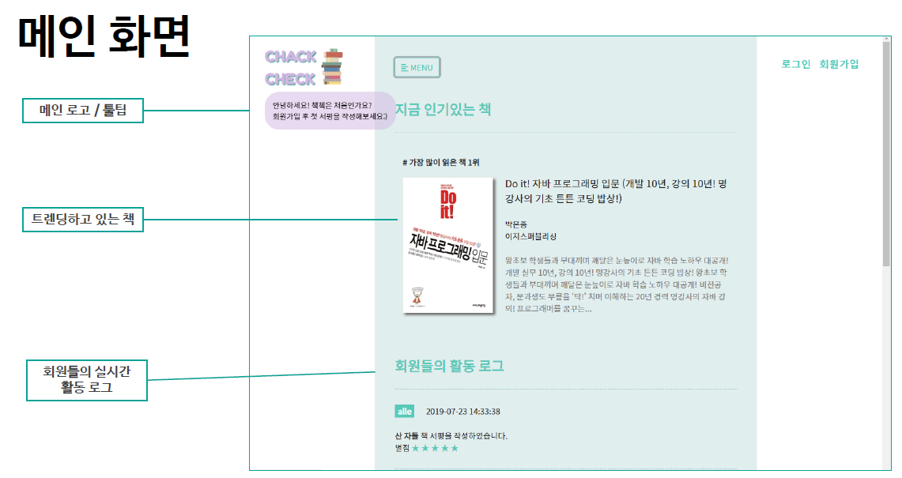
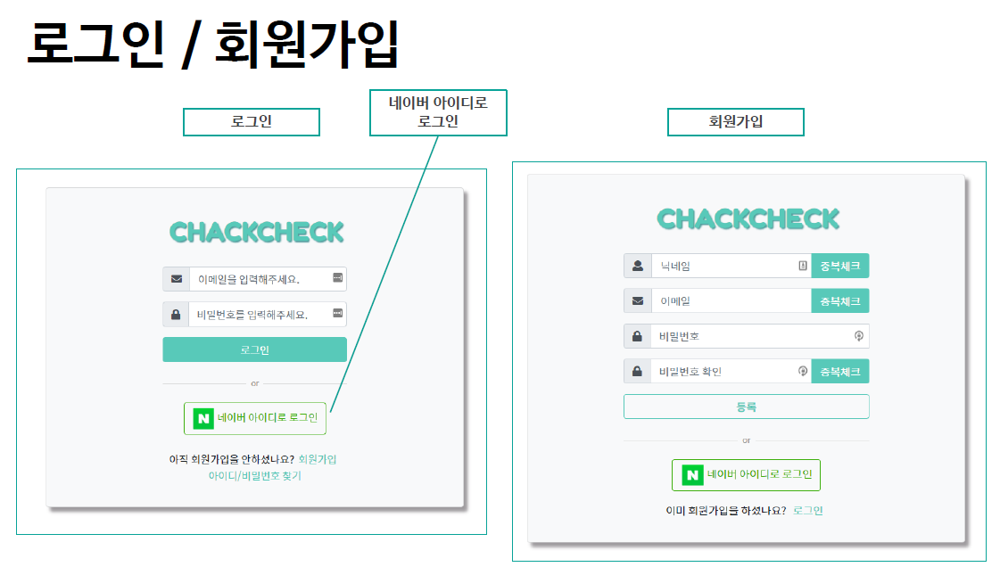

# ChackCheck

## Index

- 책 관리 홈페이지입니다. 
- 읽은 책에 대한 서평을 정리하고 관심 책을 담을 수 있습니다. 
- 사용자들이 많이 읽은 트렌드한 책 정보와 활동로그를 확인할 수 있습니다. 

## 사용기술 및 환경

- Client
  - HTML5 / CSS3 / JavaScript
  - JSP
  - Bootstrap

- Web Server

  - Spring Framework
  - Tomcat Server
  - Naver Open API(Login, BookSearch)

  

- Database

  - Oracle XE(Express Edition) 11g

  

- Development Tool

  - eclipse-jee-2018-12-R-win32-x86_64

## 실행 방법

1. 프로젝트 클론으로 내려받기
2. 이클립스 [import] - [Projects from Folder or Archive] - [프로젝트 선택] - [Finish]
3. Dependency 라이브러리 설치 완료까지 대기
4. 톰캣 등록 후 기동
5. 크롬 브라우저 - localhost:8000/book

## 화면 구성

